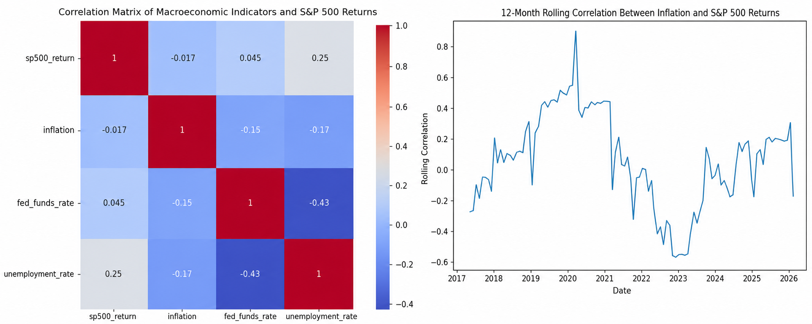

# Macroeconomic Trends & S&P 500 Returns
This product uses the FRED® API but is not endorsed or certified by the Federal Reserve Bank of St. Louis

## Contributors
- Brendan Smith
- Christopher Boukalis

## Summary
Financial markets and macroeconomic policy are a constant topic of conversation in the news, earnings calls, and central bank briefings. Most of this discussion is based on the idea that economic indicators like interest rates, inflation, and unemployment can help us understand or even predict how the stock market will behave in the future. Our team built this project to test out that theory through creating a comprehensive and reproducible pipeline. By pulling data directly from the Federal Reserve Economic Data (FRED) API, we were able to treat the relationship between the economy and the S&P 500 as a hypothesis that needed to be tested through careful data curation and statistical modeling.

For our project, we decided to focus on two main research questions. First, we were curious to see how strongly specific indicators actually correlated with monthly S&P 500 returns. We decided to select the Consumer Price Index (CPI), the Federal Funds Rate, and the Unemployment Rate, as our main variables of interest. Second, we wanted to know if those relationships stay the same over time or if they shift during major market shocks like COVID-19 in 2020, or the aggressive interest rate hikes in 2022. 

To find these answers, we developed an end-to-end automated workflow that handles the entire process, from acquiring the data through FRED, to running the regression analysis. To acquire our data from FRED, we used API calls and immediately generated SHA-256 checksums for each file. During this process, we realized that there was a frequency mismatch between our sources. While the S&P 500 data is recorded daily, the FRED indicators are only published monthly. We considered a few options to transform the data, and we ultimately decided  to aggregate the daily stock prices into a monthly average. This way, we were able to align the datasets without having to create synthetic values or losing track of the market’s performance. We then standardized everything into a common timestamp, and used an inner-join to create a final dataset that had 117 months of clean data from June 2016 to March 2026.

For our analysis, we benchmarked a linear regression model against a more complex random forest model. We started by splitting our data to maintain consistency and avoid any potential data leakage into our training set. Interestingly, we were surprised to find that both models showed us that these indicators had very little power to predict market moves. The linear regression model had an R^2 of -0.043, and the random forest model was only slightly better. Out of all the indicator variables, unemployment had the strongest correlation with market returns, which might have been partly due to the recovery period after the corona virus. Ultimately, the findings in our analysis helped us confirm that the equity markets are forward-pricing measures.

In this project, we really emphasized being as transparent as possible. Every decision we made is documented, and the entire process can be re-executed with a single shell script. Our main goal was to still maintain good data management throughout the duration of our study.

## Data Profile
### Overview
This project uses four datasets obtained from the Federal Reserve Bank of St. Louis (https://fred.stlouisfed.org/) to examine the relationship between macroeconomic conditions and S&P 500 market performance. The datasets include the Consumer Price Index (CPI), Federal Funds Rate (FEDFUNDS), Unemployment Rate (UNRATE), and S&P 500 Index (SP500). Each dataset captures a different aspect of the broader economic environment, representing inflation, monetary policy, labor market conditions, and equity market price level.

These datasets complement each other by providing useful information needed to evaluate whether macroeconomic indicators help explain changes in equity market returns. The S&P 500 is used as the primary outcome variable, while inflation, interest rates, and unemployment serve as explanatory macroeconomic feature variables.

All datasets contain a date field, which allows them to be merged using time as the primary key. The primary difference between the datasets is their reporting frequency. The S&P 500 is reported daily while the macroeconomic indicators are reported monthly. To address this, all data was standardized to a monthly time scale prior to integration. The datasets were first combined into an integrated dataset using a shared `month` variable as the primary key.

The final dataset used for analysis and regression modeling is 
- `Data_API/Integrated/fred_macro_analysis_ready.csv`.

### CPI Dataset
The Consumer Price Index (CPI) dataset is the CPIAUCSL series obtained from the FRED API (https://fred.stlouisfed.org/series/CPIAUCSL). This data measures the average change over time in prices paid by urban consumers for a broad basket of goods and services and serves as a primary indicator of inflation.

The dataset is structured as a time series with two fields, a date column and a numeric value representing the CPI index level. The data is reported at a monthly frequency and is seasonally adjusted.

Within the repository, the CPI dataset is stored at two different stages of the data pipeline
- `Data_API/Raw/CPI.csv` (raw data pulled from the FRED API)
- `Data_API/Cleaned/CPI.csv` (cleaned dataset)
### Federal Funds Dataset
The Federal Funds Rate dataset is the FEDFUNDS series obtained from the FRED API (https://fred.stlouisfed.org/series/FEDFUNDS). This dataset represents the effective federal funds rate, which is the interest rate at which banking institutions lend balances to each other overnight and serves as a key indicator of U.S. monetary policy.

The dataset is structured as a time series with two fields, a date column and a numeric value representing the interest rate level. The data is reported at a monthly frequency and is not seasonally adjusted.

Within the repository, the FEDFUNDS dataset is stored at two different stages of the data pipeline
- `Data_API/Raw/FEDFUNDS.csv` (raw data pulled from the FRED API)
- `Data_API/Cleaned/FEDFUNDS.csv` (cleaned dataset)
### Unemployment Rate Dataset
The Unemployment Rate dataset is the UNRATE series obtained from the FRED API (https://fred.stlouisfed.org/series/UNRATE). This dataset measures the percentage of the total labor force that is unemployed, but they are actively seeking employment. This indicator serves as a key indicator of labor market conditions.

The dataset is structured as a time series with two fields, a date column and a numeric value representing the unemployment rate as a percentage of the labor force. The data is reported at a monthly frequency and is seasonally adjusted.

Within the repository, the UNRATE dataset is stored at two different stages of the data pipeline
- `Data_API/Raw/UNRATE.csv` (raw data pulled from the FRED API)
- `Data_API/Cleaned/UNRATE.csv` (cleaned dataset)
### S&P 500 Dataset
The S&P 500 dataset is the SP500 series obtained from FRED API (https://fred.stlouisfed.org/series/SP500). This dataset represents the daily closing value of the S&P 500 index, which serves as a broad measure of equity market performance in the United States.

The dataset is structured as a time series with two fields, a date column and a numeric value representing the index level. Unlike the macroeconomic indicator datasets, the S&P 500 data is reported at a daily frequency.

Within the repository, the SP500 dataset is stored at two different stages of the data pipeline
- `Data_API/Raw/SP500.csv` (raw data pulled from the FRED API)
- `Data_API/Cleaned/SP500.csv` (cleaned and averaged into a monthly dataset)
### Data Usage
All of the datasets are integrated using a common primary key based off time (`month`) to create a unified dataset of macroeconomic indicators and market performance. The datasets have different reporting frequencies, so the S&P 500 data (daily) was aggregated to a monthly average to align with the monthly reporting of macroeconomic indicators (CPI, FEDFUNDS, and UNRATE).

The first stage of integration produces the dataset `Data_API/Integrated/fred_macro_integrated.csv`
 
 At this stage, the dataset represents a structured combination of cleaned economic and financial data, but it does not yet include feature variables useful for statistical analysis.

A second dataset is then created `Data_API/Integrated/fred_macro_analysis_ready.csv`

This dataset is derived from the merged and cleaned dataset. It includes additional transformations that make it more useful for analysis. Specifically, the S&P 500 index is converted into monthly returns, and CPI values are transformed into inflation rates. These transformations convert time series and level data into percentage changes, which allows for better comparison between variables.

The analysis ready dataset is used for all visualization, statistical analysis, and regression modeling. In this project, S&P 500 returns serve as the primary outcome variable, while inflation, interest rates, and unemployment serve as feature variables.
### Legal & Ethical Constraints
All data used in this project is obtained from the Federal Reserve Economic Data (FRED) API and is subject to the FRED Terms of Use. By using the API, we agreed to comply with all applicable legal, copyright, and usage restrictions associated with each data series. Some datasets may be owned by third parties such as Standard and Poors.

The project uses the FRED API in a compliant manner by retrieving data programmatically for analysis without redistributing proprietary content. Required attribution is acknowledged, and the project does not imply endorsement by the Federal Reserve Bank of St. Louis.

To ensure responsible data handling, the FRED API key is stored securely in a `.env` file and is not included in the public repository. Additionally, checksum hashes are generated for downloaded datasets and stored in `Results/Tables/fred_checksums.txt` to verify data integrity and reproducibility.

## Data Quality
### Data Quality Assessment Approach
We began our data quality phase of our project by performing a script programmatically using `Scripts/clean_merge_fred_data.py`. This script is responsible for loading each dataset, validating its structure, and generating a summary quality report saved as `Results/Tables/fred_data_quality_report.csv`.
The script evaluates multiple aspects of data quality, including the number of rows and columns in each dataset, the start and end dates of the time series, if and how many missing values or duplicated time observations there are.

We chose a to use a script approach instead of tools like OpenRefine to ensure full reproducibility and automation. Our datasets were retrieved dynamically from the FRED API, so using a Python workflow allows the entire data acquisition, validation, and integration process to be executed consistently with a single command (`run_all.sh`). This guarantees that data quality checks are applied identically each time data is fetched, inspected, cleaned and merged. Additionally, SHA-256 checksums were generated for each raw file at the time of acquisition and stored in Results/Tables/fred_checksums.txt to verify that the source data has not changed between runs. This script allowed our analysis and regressions to be repeated accurately.

### Data Quality Assessment
The data quality report generated from the script `clean_merge_fred_data.py` confirms that all datasets are structurally complete and consistent. Each dataset contains exactly two columns (a date field and a numeric value), with no missing values and no duplicate time observations. This indicates that the datasets are reliable and suitable for time series analysis. This was one of the major benefits of using FRED's API as our data source.

Despite this overall consistency, several important differences exist across the datasets that required design choices before integration. First, there are differences in the amount of time each dataset covers. The CPI, FEDFUNDS, and UNRATE datasets span multiple decades, beginning in 1947, 1948, and 1954 while the SP500 dataset begins in 2016. This mismatch meant that not all datasets share a common time horizon. Our first design choice meant that we needed to use only data with overlapping time periods. Second, there are differences in how often the data is reported. The SP500 dataset is reported at a daily frequency, while the macroeconomic datasets are reported monthly. This creates a structural inconsistency that prevents direct merging without transformation. These differences are not data quality issues, but rather characteristics of the data sources. As a result, we chose to standardize the datasets prior to integration. Specifically, all datasets were aligned to a common monthly time scale, and the final dataset was restricted to a consistent and overlapping time period to ensure comparability across variables.

| Dataset  | Rows | Columns | Start Date | End Date   | Missing Values | Duplicates |
|----------|------|---------|------------|------------|----------------|------------|
| CPI      | 950  | 2       | 1947-01-01 | 2025-03-01 | 0              | 0          |
| FEDFUNDS | 862  | 2       | 1954-07-01 | 2025-04-01 | 0              | 0          |
| UNRATE   | 938  | 2       | 1948-01-01 | 2025-03-01 | 0              | 0          |
| SP500    | 121  | 2       | 2016-05-01 | 2026-05-01 | 0              | 0          |

Although the datasets contain no missing values or duplicates, several months represent extreme observations that are worth noting. The COVID-19 period in early 2020 produced the most pronounced values across all three macroeconomic indicators simultaneously: unemployment spiked to approximately 14.7%, the Federal Funds Rate was cut to near zero, and the S&P 500 experienced a sharp drawdown before recovering within the same year. The 2022–2023 rate-hiking cycle similarly produced Federal Funds Rate values not seen since 2007. We inspected these observations and confirmed they are accurate, well-documented economic events rather than data entry errors, so they were retained in full. Excluding them would have removed the most macroeconomically significant months in the dataset and introduced its own form of bias.  

### Seasonal Adjustment Consideration
The datasets used in this project differ in whether they are seasonally adjusted. The CPI and Unemployment Rate datasets are seasonally adjusted, while the Federal Funds dataset is not seasonally adjusted. The SP500 dataset represents observed market values so it is not seasonally adjusted.

After further research into what seasonal adjustment means we found that it removes recurring patterns that occur at regular intervals. For example, employment levels often follow seasonal patterns due to factors such as holiday jobs or industries dependent on weather conditions. By adjusting for these patterns, the CPI and Unemployment Rate provides a more clear view of underlying trends.

The presence of both seasonally adjusted and non-seasonally adjusted data introduces a difference in how variables reflect temporary fluctuations. We found that this does not represent a data quality issue, but it reflects differences in how the data is defined and reported by the source.

These differences were considered acceptable for this analysis, as each dataset is used according to its intended interpretation, and the focus of the project is on general relationships between macroeconomic indicators and market performance rather than precise seasonal effects.

## Data Cleaning
Data cleaning and preparation were performed programmatically using `Scripts/clean_merge_fred_data.py` and `Scripts/analysis.py`. We chose a script-based workflow instead of manual cleaning tools to ensure that every step of cleaning, merging, and transformation could be reproduced consistently through the automated `run_all.sh` command.

The first stage of cleaning focused on structural standardization. Each dataset retrieved from the FRED API was loaded as a time series containing a date field and a numeric value field. Date columns were converted into a consistent datetime format, sorted chronologically, and renamed into a shared schema to simplify integration and analysis.

The next major cleaning step involved time normalization. The CPI, FEDFUNDS, and UNRATE datasets are reported monthly, while the SP500 dataset is reported daily. To align the datasets to a common time scale, the S&P 500 observations were aggregated into monthly averages. To aggregate the monthly average, we took the average of each reported price level within each month. This allowed all datasets to be merged consistently using the primary key `month`.

After standardization, the datasets were merged into a single integrated dataset containing inflation, interest rate, unemployment, and equity market variables observed over the same monthly periods. Due to the datasets having different amounts of time covered, the integrated dataset was restricted to the overlapping time period beginning in June 2016 to ensure consistency across all variables.

Additional transformations were applied in `Scripts/analysis.py` to create the final analysis dataset. The S&P 500 monthly averages were converted into monthly returns using percentage change, and CPI values were converted into monthly inflation rates. These transformations convert raw index levels into percentage change variables that are more suitable for correlation analysis and regression modeling. Percentage change variables were used for CPI and S&P 500 returns, because they better capture changes in economic and market conditions over time and allow variables measured on different scales to be compared consistently in regression analysis.

The raw datasets did not contain missing values or duplicate observations. Missing values were only introduced during percentage change calculations, because the first observation does not have a previous month available for comparison. These rows were removed prior to statistical analysis and regression modeling.

The cleaned and merged dataset is saved as:

- `Data_API/Integrated/fred_macro_integrated.csv`

The final analysis-ready dataset used for visualization and regression modeling is saved as:

- `Data_API/Integrated/fred_macro_analysis_ready.csv`

### Cleaning Scripts and Their Outputs
Cleaning scripts:
- `Scripts/clean_merge_fred_data.py`
- `Scripts/analysis.py`
The primary cleaning and merging workflow is implemented in `Scripts/clean_merge_fred_data.py`. This script standardizes dataset structure, converts date fields into a common monthly format, aggregates daily S&P 500 observations into monthly averages, generates the data quality report, merges all datasets using the `month` variable, and creates checksum hashes for reproducibility verification.

Additional transformations are performed in `Scripts/analysis.py`. This script transforms CPI and S&P500 levels into perecent change variables for inflation and S&P 500 returns. The script also removes the first rows that generated missing values from turning them into percent levels. Last, it produces the final analysis dataset used for visualization and regression modeling.

Intermediate outputs:
- `Data_API/Cleaned/CPI.csv`
- `Data_API/Cleaned/FEDFUNDS.csv`
- `Data_API/Cleaned/UNRATE.csv`
- `Data_API/Cleaned/SP500.csv`

Integrated datasets:
- `Data_API/Integrated/fred_macro_integrated.csv`
- `Data_API/Integrated/fred_macro_analysis_ready.csv`

## Findings
The correlation analysis showed a mixed picture across the three macro indicators. The variable that showed the strongest relationship with the S&P 500 was unemployment rate, with a correlation score of 0.249. On the surface, this seems to be the opposite of what most people would expect. However, this result was mostly shaped by the COVID-19 recovery period, when unemployment spiked in early 2020, equity markets simultaneously had one of their fastest recoveries in history. Thus, although this seems abnormal at first, the unemployment scatter plot actually makes this relationship visible. Most data points are clustered around low unemployment levels, while a handful of high-unemployment months sit at higher return values, which gives the trend line a positive slope.

Inflation, measured via the CPI, produced a near-zero correlation of −0.017, essentially showing that month-to-month changes in consumer prices carry almost no relationship with the S&P 500 returns. The Federal Funds Rate correlation was similarly very low, at only 0.045. The correlation heatmap displays these results clearly: the row corresponding to sp500_return is washed out in light blue across all three indicators, while the stronger relationship visible in the matrix is actually between the Federal Funds Rate and unemployment (−0.43), which reflects the Fed's rate-cutting response to labor market deterioration, a policy unrelated to how equities perform.

The 12-month rolling correlation chart between inflation and S&P 500 returns shows an important relationship that would typically be hard to notice. The relationship between the two variables was moderately positive through the 2018–2020 period, spiked briefly near 0.9 during the initial pandemic volatility, then decreased significantly through 2021–2023 as the Fed began to aggressively hike rates in response to post-covid inflation. By 2024 the rolling correlation had recovered back toward zero, showing us that the direction and strength of this relationship is dependent on different factors, not something a simple linear model can effectively capture.

On the modeling side, the Linear Regression achieved an R^2 value of −0.043, and the Random Forest improved slightly to 0.037. These near-zero R^2 values don’t represent a failure of the pipeline, in fact, they’re an important finding for our study. Macroeconomic indicators like CPI, the Federal Funds Rate, and the Unemployment Rate are lagging signals by design, which means that they describe economic conditions that have already occurred. Equity prices, on the other hand, are forward-pricing indicators that incorporate expectations well before those conditions appear in any government report. Essentially, the models clarify one important fact; once you control for the dataset's time structure, these indicators contribute almost no incremental predictive power.

## Future Work

Our deep-dive into the relationship between the S&P 500 and Federal Reserve macroeconomic indicators set us up with a useful baseline for understanding how equity markets respond to fiscal and monetary data. Although our findings showed that basic linear and nonlinear regressions provided insignificant predictive power, these results are not an endpoint. Instead, they highlight critical lessons for us regarding data frequency and market efficiency.

**Lessons Learned in Data Curation**

The primary lesson learned during this project centered on the importance of data frequencies. When we began managing our dataset, the dependent variable (S&P 500) was recorded daily while the independent variables (CPI, Unemployment) were reported monthly, causing a significant challenge with the alignment.

Quickly, we realized that simply "joining" the data on a date column was not going to work for financial curation. Decisions regarding whether to use the first day of the month, the last trading day, or an average of the month significantly impact the integrity of the results. We ultimately chose to resample the S&P 500 to the average of each month to reflect the market's overall verdict after absorbing that month's economic news. We knew that if we didn’t clearly explain the logic behind our resampling, our results would be much more difficult to reproduce academically. 

We also realized an important fact about modeling while we created our linear & non-linear regressions. The lesson was essentially that increasing the complexity of a model cannot overcome ‘stale’ data. If the data itself doesn’t contain a predictive signal, even more advanced Machine Learning techniques like Random Forest and XGBoost might still fail to significantly improve accuracy. 

**Potential Future Work**

To build upon the foundation that we created, we have selected four valuable methods for future research that would enhance both the analytical depth and the curation quality of the repository.

- *Predictive Lag-Based Analysis:* One thing that can be used to potentially improve the regression component of our project is to implement additional lagged feature variables. Future work should pivot from "correlation" to "prediction" by introducing additional lagged or rolling variables. By using T-2 or T-3 macroeconomic data to predict T+1 S&P 500 returns, we can test if these indicators act as leading signals, and might improve accuracy overall.
- *Time Expansion & Cycle Testing:* Our current dataset focuses on a time frame starting in June 2016. While this period included the COVID-19 volatility and following interest rate hikes, it represents a specific “era” of very unpredictable market behavior. In the future, one potential modification could be to extend this study back to the 1990s or the 2008 Financial Crisis. Testing our models across multiple full-market cycles would determine if the correlations we found are permanent or simply symptoms of the current environment.
- *Sector-Level Granularity:* The S&P 500 is an aggregate of many different industry sectors with varying sensitivities to macro trends. Technology growth stocks are typically more sensitive to interest rates than utility stocks. Future work should try to apply our cleaning and merging logic to specific Sector ETFs (like Tech, Energy, Retail) to identify if macroeconomic indicators "hide" within the broad index while exerting massive influence on specific industries.
- *Forward-Looking Sentiment:* A significant improvement would involve integrating "forward-looking" survey data, such as the University of Michigan Consumer Sentiment Survey or inflation expectation indices. Unlike government reports that record what has already happened, these surveys capture public expectations of the future, which often drive market momentum. From a curation perspective, this would require developing new workflows to normalize qualitative survey indices and align them with quantitative financial time-series.
  
## Challenges
The hardest part of this project wasn't the actual modeling. Instead, it was the data curation work that had to happen before we could even build a regression model. We had to wrangle four different datasets into one trustworthy file, which led to two main hurdles. Both of them  required us to make a deliberate choice about how to handle the data.

**Time Frequency Mismatch**

The most significant challenge was the difference in how our sources report data. The S&P 500 is a live market, so it records a closing price for every single business day. However, the macro indicators like inflation and unemployment are only published once a month. This essentially caused a mismatch in what the data actually measures. One row of S&P 500 data represents a single day, while a row of unemployment data represents a whole month. If we tried to join them using raw dates, we would have ended up with massive duplication or lost almost all of our stock data.

We decided to solve this by turning the daily S&P 500 values into a monthly average. This kept all the information from the stock market without dropping any trading days. It also let us match the granularity of the FRED data without having to "invent" daily values for things like inflation, which wouldn't have been accurate.

**Date Normalization**

Even after we moved everything to a monthly scale, the timestamps still didn't match up. FRED exports dates that always start on the first of the month, like 2023-01-01. The S&P 500 data, because it was averaged from daily records, often produced dates at the end or middle of the month. A basic join would have returned zero results because the computer sees those as different days, even though they represent the same month.

To fix this, we stripped each timestamp down to a simple month key in YYYY-MM format before joining. This acted as a common language between the sources. It discarded the day-level precision that we didn't need and created a join key that worked every time. Although this step was simple, it ended up being crucial.

## Reproducibility
The project is designed to be reproduced from a cloned repository using the provided scripts and workflow file. The full pipeline downloads data from the FRED API, cleans and integrates the datasets, creates analysis ready variables, generates figures and tables, and runs regression models.

1. Clone the Repository
`git clone https://github.com/BrendanGSmith24/DataChiefs.git` then use 
`cd DataChiefs`

2. Create .Env File
 To recreate this workflow, you must obtain your own FRED API key from the Federal Reserve Bank of St. Louis. We did not include the API key in this repository to follow FRED's terms of use.

3. Insert API Key to .Env File
In the root directory of the repository, create a file named `.env`. Inside `.env`, add the lines `FRED_API_KEY=(insert your API key here with no quotes or spaces)` We used .env to represent enviroment variables that should never go public on GitHub.

4. Install Dependencies
To install the required Python packages to recreate this project use `pip install -r requirements.txt` all packages used are in `requirements.txt`

5. Run the Full Workflow
The project workflow is automated through the shell script `./run_all.sh` which executes the full pipeline in sequential order.

6. Expected Output Files
- Raw API data:
- Data_API/Raw/CPI.csv
- -Data_API/Raw/FEDFUNDS.csv
- Data_API/Raw/UNRATE.csv
- Data_API/Raw/SP500.csv
#### Cleaned data:
- Data_API/Cleaned/CPI.csv
- Data_API/Cleaned/FEDFUNDS.csv
- Data_API/Cleaned/UNRATE.csv
- Data_API/Cleaned/SP500.csv
#### Integrated and analysis ready data:
- Data_API/Integrated/fred_macro_integrated.csv
- Data_API/Integrated/fred_macro_analysis_ready.csv
#### Tables from Analysis:
- Results/Tables/fred_data_quality_report.csv
- Results/Tables/fred_checksums.txt
- Results/Tables/summary_stats.csv
- Results/Tables/correlation_matrix.csv
- Results/Tables/regression_model_comparison.csv
- Results/Tables/linear_regression_coefficients.csv
- Results/Tables/random_forest_feature_importance.csv
- Results/Tables/regression_summary.txt
#### Figures from Analysis:
- Results/Figures/correlation_heatmap.png
- Results/Figures/sp500_returns.png
- Results/Figures/scatter_inflation.png
- Results/Figures/scatter_fed_funds_rate.png
- Results/Figures/scatter_unemployment_rate.png
- Results/Figures/rolling_corr_inflation.png

7. Ensure Data Integrity
Checksum hashes are generated for the downloaded and processed datasets and saved in: 
`Results/Tables/fred_checksums.txt` 
The FRED API requests we used have fixed observation dates to improve reproducibility. This helps ensure that future runs retrieve the same date range instead of automatically including newly released observations.

## References

U.S. Bureau of Labor Statistics. (2025). Consumer Price Index for All Urban Consumers: 
All Items in U.S. City Average (CPIAUCSL) [Data set]. Federal Reserve Bank of St. Louis. 
https://fred.stlouisfed.org/series/CPIAUCSL

Board of Governors of the Federal Reserve System. (2025). Federal Funds Effective Rate 
(FEDFUNDS) [Data set]. Federal Reserve Bank of St. Louis. 
https://fred.stlouisfed.org/series/FEDFUNDS

U.S. Bureau of Labor Statistics. (2025). Unemployment Rate (UNRATE) [Data set]. 
Federal Reserve Bank of St. Louis. https://fred.stlouisfed.org/series/UNRATE

S&P Dow Jones Indices LLC. (2025). S&P 500 (SP500) [Data set]. Federal Reserve Bank 
of St. Louis. https://fred.stlouisfed.org/series/SP500

Harris, C. R., Millman, K. J., van der Walt, S. J., et al. (2020). Array programming 
with NumPy. Nature, 585, 357–362. https://doi.org/10.1038/s41586-020-2649-2

Hunter, J. D. (2007). Matplotlib: A 2D graphics environment. Computing in Science & 
Engineering, 9(3), 90–95. https://doi.org/10.1109/MCSE.2007.55

Pedregosa, F., Varoquaux, G., Gramfort, A., et al. (2011). Scikit-learn: Machine 
learning in Python. Journal of Machine Learning Research, 12, 2825–2830. 
https://jmlr.org/papers/v12/pedregosa11a.html

The pandas development team. (2024). pandas-dev/pandas: Pandas [Software]. Zenodo. 
https://doi.org/10.5281/zenodo.3509134

Waskom, M. L. (2021). seaborn: Statistical data visualization. Journal of Open Source 
Software, 6(60), 3021. https://doi.org/10.21105/joss.03021

